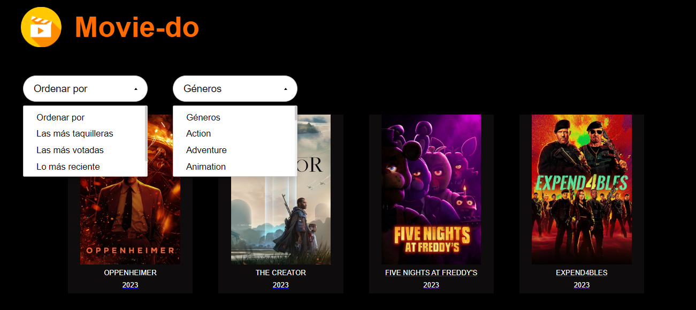

# Bienvenido/a a nuestro Catálogo de Películas Movie-do

¡Gracias por elegir nuestro Catálogo de Películas! Esta aplicación, meticulosamente desarrollada con React JS, te brinda una experiencia única al permitirte explorar y filtrar películas según tus preferencias. Sumérgete en la diversidad del mundo cinematográfico con una interfaz intuitiva y herramientas de filtrado avanzadas, diseñadas para satisfacer tus necesidades de entretenimiento.

()

## Acerca de la Aplicación

Nuestro Catálogo de Películas no es solo una plataforma para descubrir nuevas películas; es una experiencia cinematográfica completa. Con un diseño moderno y elegante, la aplicación facilita la exploración de una amplia variedad de películas, desde clásicos atemporales hasta los últimos estrenos de taquilla.

## Características Destacadas

- **Exploración Intuitiva:** Navega por una extensa biblioteca de películas de manera fácil y rápida.
- **Filtrado Avanzado:** Personaliza tu búsqueda con opciones de filtrado que se adaptan a tus gustos únicos.
- **Ordenación Eficiente:** Clasifica las películas según diferentes criterios para encontrar exactamente lo que estás buscando.

## Prototipo de alta fidelidad
- **Derrollado en figma:** Este prototipo fue diseñado en figma para poder dar respuesta a cada historia de de usuarix, de una manera dinamica.

Explora nuestro diseño de interfaz de usuario en [Figma](https://www.figma.com/proto/9kKN2jI3YgtRfjSvsEjBdC/Movie-do?type=design&node-id=0-1&t=ef71ROP7xGsrzo7e-0&scaling=scale-down&page-id=0%3A1&starting-point-node-id=1%3A2).


## Instalación Rápida

1. **Clonar el Repositorio:**
    ```bash
    git clone https://github.com/tu-usuario/catálogo-de-películas.git
    ```

2. **Navegar al Directorio del Proyecto:**
    ```bash
    cd catálogo-de-películas
    ```

3. **Instalar Dependencias con Yarn:**
    ```bash
    yarn install
    ```

## Configuración Personalizada

1. **Crear un Archivo `.env`:**
   - En el directorio raíz del proyecto, crea un archivo `.env`.

2. **Completar el Archivo `.env`:**
   - Agrega tu clave de API proporcionada por [Nombre de la Fuente de Datos].
   ```env
   REACT_APP_API_KEY=TU_API_KEY

